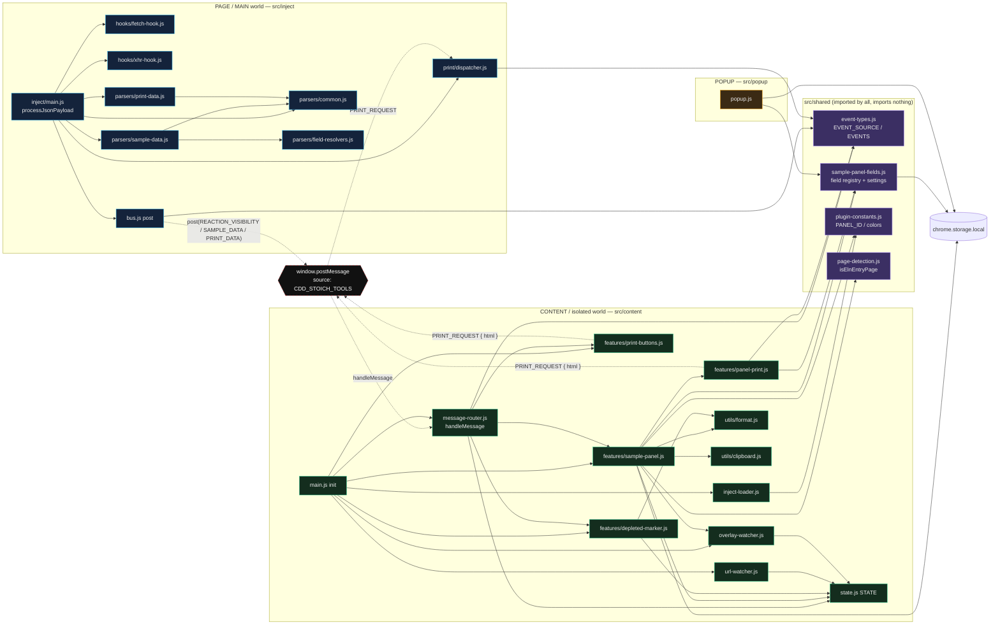

# Data Flow Diagrams — CDD fetch/XHR → Sample Panel

> Audience: a maintainer who wants to see, end to end, how one CDD network
> response becomes rendered cards in the floating **Sample Panel** — including
> the exact objects and payloads that travel between modules and across the
> two-world boundary.
>
> Both diagrams are [Mermaid](https://mermaid.js.org/) and render directly on
> GitHub. Everything below is taken from the actual source; function and field
> names match the code.

---

## 1. Sequence diagram (with objects & payloads)

This traces the **happy path**: CDD downloads an ELN entry → the inject hooks
capture it → parsers flatten it → it crosses into the content world via
`postMessage` → the panel renders. The `REACTION_VISIBILITY` and `PRINT_DATA`
branches that fire from the *same* `processJsonPayload()` call are shown too,
because they share the trip.

```mermaid
sequenceDiagram
    autonumber
    participant CDD as CDD Vault server
    participant PageJS as Page JS (CDD's own fetch/XHR)
    box rgb(20,30,55) PAGE / MAIN world  (src/inject)
        participant Hook as hooks/fetch-hook.js<br/>xhr-hook.js
        participant Common as parsers/common.js
        participant Main as inject/main.js<br/>processJsonPayload()
        participant SData as parsers/sample-data.js
        participant FRes as parsers/field-resolvers.js
        participant PData as parsers/print-data.js
        participant Bus as bus.js post()
    end
    participant WMsg as window.postMessage<br/>(world boundary)
    box rgb(20,45,30) CONTENT / isolated world  (src/content)
        participant Router as message-router.js<br/>handleMessage()
        participant State as state.js STATE
        participant Panel as features/sample-panel.js
        participant Reg as shared/sample-panel-fields.js<br/>(field registry)
        participant Store as chrome.storage.local
        participant DOM as Panel DOM (#cdd-stoich-panel)
    end

    CDD-->>PageJS: HTTP response (ELN entry JSON)
    PageJS->>Hook: window.fetch(...) / XHR load<br/>(hook wraps the real call)
    Note over Hook: fetch: clone(); if content-type ~ json → clone.json()<br/>else tryParseText(clone.text())<br/>xhr: tryParseText(responseText)

    Hook->>Common: tryParseText(text)  [non-json path]
    Common->>Common: JSON.parse(text)
    Common->>Main: processJsonPayload(data)
    Hook->>Main: processJsonPayload(json)  [json path]

    Note over Main,Common: data = { eln_entry: { feature_map:{…}, title, identifier } }
    Main->>Common: isElnPayload(data)?
    Common-->>Main: true  (has eln_entry.feature_map)
    Main->>Common: hasAnyReactionFeature(data)?
    Common-->>Main: hasReaction = true/false

    Main->>Bus: post("REACTION_VISIBILITY", { visible: hasReaction })
    Bus->>WMsg: postMessage({ source:"CDD_STOICH_TOOLS", type, payload })
    WMsg->>Router: handleMessage(event)
    Router->>State: STATE.hasReactionFeature = visible
    alt visible === false
        Router->>Panel: removePanel()
    else visible === true
        Router->>Panel: renderFromState()
    end

    Note over Main: if (!hasReaction) return  ← stops here for non-reaction pages

    Main->>SData: extractAllReactionRows(data)
    SData->>Common: getReactionFeatures(payload)
    Common-->>SData: [ feature{ type:"reaction", id, data.stoichiometryTable } ]
    loop each reaction feature → each row with row.sample
        SData->>SData: dedupe key = reactionIndex::rowUid::sampleId
        SData->>FRes: resolveBatchFields / resolveSampleFields /<br/>resolveMoleculeFields / resolveIdentityFields /<br/>resolveQuantityFields / collectCustomFields
        FRes-->>SData: { purity, density, internalID, concentration,<br/>solvent, moleculeName, …, customBatchFields, customSampleFields }
    end
    SData-->>Main: { reactionCount, samples:[ flatSample, … ] }

    Note over Main,Bus: flatSample = { reactionIndex, reactionLabel, sampleId,<br/>name, location, purity, density, internalID,<br/>concentration, concentrationUnits, solvent,<br/>molecule*/formula*, batchName, vendorId, owner,<br/>amount(+amountUnit), volume,<br/>customBatchFields:{…}, customSampleFields:{…} }

    opt samples.length > 0
        Main->>Bus: post("SAMPLE_DATA", { reactionCount, samples })
        Bus->>WMsg: postMessage({ source, type:"SAMPLE_DATA", payload })
        WMsg->>Router: handleMessage(event)
        Router->>State: STATE.lastPayload = payload
        Router->>Panel: renderFromState()
    end

    Main->>PData: extractPrintData(data)
    PData-->>Main: { reactionPayloads:[…], depletedIdentifiers:[…] }
    Main->>Bus: post("PRINT_DATA", printResult)
    Bus->>WMsg: postMessage(...)
    WMsg->>Router: handleMessage(event)
    Router->>State: STATE.reactionPayloads = […]<br/>STATE.depletedIdentifiers = Set(normalized ids)
    Note over Router: setTimeout(50ms) → ensurePrintButtons() + markDepletedSamplesInSelector()

    rect rgb(40,30,15)
    Note over Panel,DOM: ── renderFromState() — the actual paint ──
    Panel->>Panel: guards: isElnEntryPage() && hasReactionFeature && !isKetcherOpen
    Panel->>DOM: ensurePanel()  (create #cdd-stoich-panel once)
    alt STATE.lastPayload is null
        Panel->>DOM: setStatus("Waiting for reaction data…")
    else has payload
        Panel->>DOM: setStatus("Loaded N sample(s) from M reaction(s).")
        Panel->>Panel: renderSamples(STATE.lastPayload)
        Panel->>Reg: discoverCustomFields(samples)
        Panel->>Store: getDiscoveredCustomFields()
        Store-->>Panel: stored custom fields [+lastSeen]
        Panel->>Reg: touchSeenCustomFields() + pruneExpiredCustomFields(now)
        Panel->>Store: saveDiscoveredCustomFields(list)  (only if changed)
        Panel->>Panel: groupSamplesByReaction(samples)
        loop each reaction group → each sample card
            Panel->>Reg: parsePurity(sample.purity)  → low-purity badge if ≤ 93
            Panel->>Panel: isSampleDepleted(sample) vs STATE.depletedIdentifiers
            loop each enabled field (visibleFields)
                Panel->>Reg: resolveFieldValue(field, sample)
                Reg-->>Panel: { text, copyValue, highlight } | null
                Panel->>DOM: createCopyableRow(label, text)  (click → copy)
            end
        end
        Panel->>DOM: list.replaceChildren(groups…)
    end
    end
```

### What each payload looks like (quick reference)

| Step | Object / payload | Shape (key fields) |
| --- | --- | --- |
| CDD response | `data` | `{ eln_entry: { feature_map: {…}, title, identifier } }` |
| reaction feature | `feature` | `{ type:"reaction", id, data: { stoichiometryTable: { rows:[…], samples:{…} }, reactionImage } }` |
| raw row | `row` | `{ uid, role, sample:{ id, sample_identifier, name, location, batch_fields, … }, molecule, amount, … }` |
| message envelope | postMessage data | `{ source:"CDD_STOICH_TOOLS", type, payload }` |
| `REACTION_VISIBILITY` | payload | `{ visible: boolean }` |
| `SAMPLE_DATA` | payload | `{ reactionCount: number, samples: flatSample[] }` |
| `flatSample` | one sample | `{ reactionIndex, reactionLabel, sampleId, name, location, purity, density, internalID, concentration, concentrationUnits, solvent, moleculeName, molecularFormula, molecularWeight, formulaWeight, batchName, vendorId, owner, amount, amountUnit, volume, customBatchFields:{name→value}, customSampleFields:{name→value} }` |
| `PRINT_DATA` | payload | `{ reactionPayloads:[{ reactionIndex, title, featureId, rows[], identifier, reactionImage }], depletedIdentifiers: string[] }` |
| resolved field | `resolveFieldValue` | `{ text, copyValue, highlight } | null` |

### Things worth knowing while reading the sequence

- **One response can fire up to three messages** (`REACTION_VISIBILITY`,
  `SAMPLE_DATA`, `PRINT_DATA`) from a single `processJsonPayload()` call.
- **The content side never sees CDD's nested JSON.** All shape-knowledge stays in
  `field-resolvers.js`; the content world only ever receives flat `flatSample`
  objects.
- **Rendering is idempotent and re-entrant.** `renderFromState()` is called from
  the router on every message, from the Refresh button, on SPA navigation, and on
  a settings change — it always rebuilds from `STATE.lastPayload`.
- **`resolveFieldValue` never throws** — a field with no value returns `null` and
  its row is simply skipped, so a malformed payload degrades to empty rows.
- **Custom-field discovery writes a *different* storage key** than the visible-
  field settings, so persisting discoveries does not re-trigger the settings
  `onChanged` listener (which would cause a render loop).

---

## 2. Module dependency diagram

Arrows mean **"imports / calls"**. Note the one rule that keeps the design clean:
`src/shared/` is imported by everyone and imports nothing. The only link between
the two worlds is `window.postMessage` (dashed).



### How to read this diagram

- **The two big boxes are the two JavaScript worlds.** They cannot call each
  other directly — every dashed arrow goes through `window.postMessage`.
- **`sample-panel-fields.js` (REG) is the hub of the sample-panel feature.** It is
  imported by the in-page panel (`SP`), the panel print builder (`PP`), **and**
  the popup (`PJS`). That triple use is exactly why it lives in `shared/` and is
  kept DOM-free.
- **`state.js` (ST) is the content-side spine.** Router writes it; panel, print
  buttons, depleted marker, and the watchers read it.
- **The popup talks to nothing in the page** — it only reads/writes
  `chrome.storage.local` and imports the shared registry. The content panel picks
  up changes through a `chrome.storage.onChanged` listener (in
  `initSamplePanelFields`).
- **Two `PRINT_REQUEST` producers, one consumer:** both `panel-print.js` and
  `print-buttons.js` post `PRINT_REQUEST`; only `print/dispatcher.js` (page world)
  handles it and prints into a hidden iframe.

> Not every content module is drawn (the `ui-fixes/*`, `eln-title.js`,
> `dose-response-override/*`, and `cdd-api.js` are independent of the Sample-Panel
> data flow). They are all registered the same way — imported and called from
> `main.js init()` — but they do not participate in the
> fetch → parse → message → render pipeline shown here.
</content>
